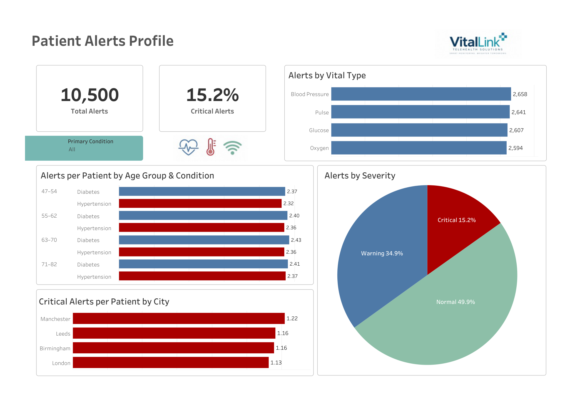
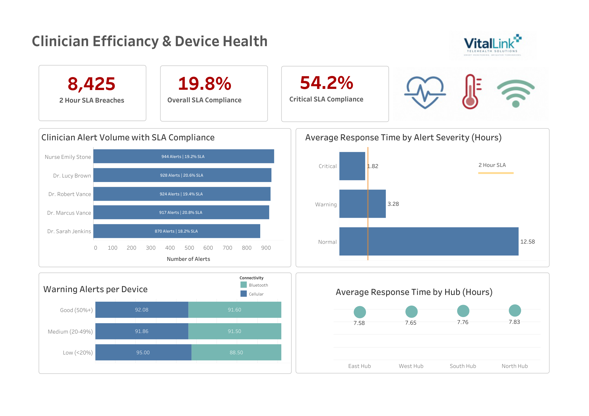

# Vitalink-telehealth-tableau-analysis
Tableau analysis of synthetic remote patient monitoring data, exploring patient alerts, clinician response performance, SLA compliance and device health.
# VitalLink Telehealth Analytics | Tableau

## Remote Patient Monitoring & Clinical Response Analysis

This project analyses a synthetic remote patient monitoring dataset for **VitalLink Telehealth Solutions**, exploring patient alert patterns, clinician response performance, SLA compliance and device health.

The project was developed as a Tableau data analytics capstone and subsequently refined for my portfolio. During the analysis, I revisited several initial findings by examining appropriate denominators, normalising raw counts and performing additional exploratory analysis. This resulted in a more nuanced understanding of patient alert demand and clinical response performance.

## Dashboards

### Patient Alerts Profile

### Clinician Efficiency & Device Health

## Business Questions

The analysis was designed to investigate eight key questions across patient alerts, clinician performance and device health:

1. What is the total volume of alerts, and what proportion are Critical?
2. Which vital sign type generates the most alerts?
3. How are alerts distributed across patient age groups and primary conditions?
4. Are particular patient locations associated with disproportionately high Critical alert volumes?
5. How does average clinician response time compare across the four operational hubs?
6. How many alerts breach the stated 2-hour response SLA?
7. Which clinicians manage the highest alert volumes, and how does workload relate to SLA compliance?
8. Is there evidence of a relationship between device battery status, connectivity type and Warning alert frequency?

## Dataset

The synthetic dataset contains **10,500 alert records** linked to **5,000 patients, 12 clinicians and 40 monitoring devices**.

The data is structured across four related tables:

| Table | Purpose |
|---|---|
| `Vital_Alert_Fact` | Alert-level records including vital type, severity and response time |
| `Dim_Patient` | Patient demographics, location and primary condition |
| `Dim_Clinician` | Clinician details and operational hub |
| `Dim_Device` | Device model, connectivity type and battery status |

Relationships were created in Tableau using the relevant Patient, Clinician and Device IDs.

## Tools & Skills

**Tableau Public** • **Excel** • Data visualisation • Dashboard design • Calculated fields • KPI development • Data normalisation • Exploratory analysis • Healthcare analytics • Service improvement

## Key Findings & Analytical Development

### 1. Alert volume and severity

A total of **10,500 alerts** were recorded, of which **1,591 (15.2%) were Critical**.

Although Critical alerts represented a minority of total activity, the absolute volume represents a substantial number of priority alerts requiring timely review. However, the dataset does not provide a clearly defined reporting period or historical benchmark, so it is not possible to determine whether the overall volume is unusually high or low.

Alert volumes were also distributed relatively evenly across the four monitored vital types. Blood Pressure generated the most alerts (2,658), but only 64 alerts separated the highest and lowest categories, providing little evidence that a single vital type was driving overall demand.

### 2. Raw patient counts initially suggested an age effect

Initial analysis showed the **71–82 age group generating the highest number of alerts**. However, this age band covered a wider range and contained more patients than the other groups.

I therefore recalculated the measure as **alerts per unique patient**.

After normalisation, alert frequency was remarkably consistent across age groups at approximately **2.32–2.43 alerts per patient**.

This changed the interpretation: the higher raw alert volume among older patients was primarily associated with the size of the patient group rather than substantially greater alert frequency per individual.

### 3. Regional differences reduced after normalisation

New York generated the highest raw number of Critical alerts in the original dataset.

After adjusting for the number of patients and adapting the geographic labels for the UK portfolio version, **Manchester remained highest at 1.22 Critical alerts per patient**, but rates across all four locations were relatively similar at **1.13–1.22**.

This provided limited evidence of a major geographic disparity.

### 4. Overall SLA performance masked substantial differences by severity

At first glance, SLA performance appeared extremely poor:

- **8,425 of 10,500 alerts breached the stated 2-hour target**
- **Overall SLA compliance: 19.8%**

Further analysis by alert severity produced a much more informative picture:

| Severity | Average Response Time | SLA Compliance |
|---|---:|---:|
| Critical | 1.82 hours | 54.2% |
| Warning | 3.28 hours | 27.0% |
| Normal | 12.58 hours | 4.3% |

The clear reduction in response time as severity increases suggests that clinicians are prioritising higher-risk alerts.

However, the average Critical response time of 1.82 hours should not be interpreted as satisfactory SLA performance: **45.8% of Critical alerts still exceeded the stated 2-hour target**.

This also raised an important business question about whether the same 2-hour SLA is clinically intended for Critical, Warning and Normal alerts.

### 5. Clinician workload did not explain SLA compliance

The five highest-volume clinicians handled between **870 and 944 alerts**, with SLA compliance ranging from approximately **18% to 21%**.

To investigate whether workload might explain differences in compliance, I extended the analysis to all 12 clinicians and examined the relationship between alert volume and SLA compliance.

The resulting linear relationship was effectively negligible (**R² < 0.001, p = 0.976**).

This suggests that alert volume alone does not explain differences in SLA compliance and that other operational factors require investigation.

### 6. Raw device counts produced a misleading initial impression

Initial raw counts suggested that devices with Good battery status generated more Warning alerts.

However, the battery groups contained different numbers of devices. I therefore normalised Warning alerts by the number of unique devices in each battery/connectivity group.

Good and Medium battery groups subsequently showed very similar rates of approximately **91–92 Warning alerts per device** across Bluetooth and Cellular connectivity.

The Low-battery group showed greater variation, but contained only **three devices**, making the result too small to support a reliable conclusion.

Overall, the analysis provides little evidence that battery status or connectivity type is currently a major driver of Warning alert frequency.

### 7. Regional response performance was highly consistent

## Recommendations

### 1. Review the end-to-end alert response pathway

Conduct a structured review with clinicians and operational staff, mapping the journey from alert generation through receipt, triage, allocation, clinical review, action and closure.

The review should identify potential delays, unnecessary hand-offs, duplication, unclear ownership and other workflow bottlenecks not visible within the dataset.

The basis of the **2-hour SLA should also be validated**, including whether it is a clinical, contractual or internally defined standard and whether the same response target is appropriate across all alert severities.

### 2. Investigate Critical alert SLA breaches

The analysis indicates that clinicians are already responding according to severity, with Critical alerts receiving the fastest average response.

However, **45.8% of Critical alerts still exceeded the stated 2-hour target**.

Investigation should therefore focus on the circumstances surrounding these Critical breaches, including workflow, capacity, allocation and timing factors, rather than assuming that clinicians are failing to prioritise high-risk alerts.

### 3. Review severity-based triage

Clearly define the expected response to **Critical, Warning and Normal alerts**.

Explore whether Warning alerts can be used proactively to identify deterioration before escalation to Critical status, while ensuring this does not divert resources from higher-risk cases.

### 4. Prioritise service-wide improvement over regional intervention

Current evidence does not support targeting a particular city or operational hub.

Critical alert rates per patient were relatively similar across locations, while average hub response times differed by only 15 minutes.

Service-wide process improvement is therefore more strongly supported by the current analysis, although future analysis should compare severity-specific performance and case mix between hubs.

### 5. Continue monitoring device performance

No immediate intervention relating to battery status or connectivity is supported by the current analysis.

Warning alert frequency was similar across Good and Medium battery groups after normalisation. Low-battery devices should continue to be monitored, particularly if their number increases sufficiently to support more reliable comparison.

### 6. Monitor patient demand rather than targeting older patients solely by age

The current analysis does not support allocating additional resources to the 71–82 age group based on alert frequency alone, as per-patient alert rates were similar across age groups.

However, because this represents a relatively large patient group, even a modest increase in alert frequency could have a meaningful effect on overall service demand.

Average response times across the four operational hubs ranged from **7.58 to 7.83 hours** — a difference of only 15 minutes between the fastest and slowest hub.

This provides little evidence that poor overall response performance is isolated to one particular region. However, these averages should be interpreted alongside alert severity because response times vary substantially between Critical, Warning and Normal alerts.

Several limitations should be considered when interpreting this analysis:

- **Synthetic data:** The dataset is synthetic and therefore does not represent real patients, clinicians or service performance.

- **Undefined reporting period:** The dataset does not clearly establish the period over which the 10,500 alerts were generated. This limits interpretation of whether overall alert volumes are high or low.

- **No historical or target benchmark:** There is no previous-period or expected alert volume against which current activity can be compared.

- **SLA definition:** A 2-hour response SLA is stated in the project brief, but the dataset does not establish whether this is a clinical, contractual or internal operational standard, or whether the same target should apply to all alert severities.

- **Limited operational context:** The dataset does not contain staffing levels, shift patterns, clinician availability, workload capacity, time of day, case complexity, workflow stages or geographical travel information. The underlying causes of response delays therefore cannot be determined from this analysis alone.

- **Severity mix:** Overall clinician and hub response measures may be influenced by differences in the proportion of Critical, Warning and Normal alerts handled. Further severity-adjusted analysis would strengthen comparisons.

- **Small Low-battery sample:** Only three devices were classified as Low battery, limiting the reliability of comparisons involving this group.

- **Exposure time:** Warning alerts were normalised per unique device, but the dataset does not establish whether all devices were monitored for equal periods. Alerts per device should therefore not be interpreted as a true time-based incidence rate.

- **Clinician workload analysis:** The exploratory relationship between alert volume and SLA compliance included only 12 clinicians. The absence of a linear association does not demonstrate that workload can never influence response performance.

## Project Files

- [Patient Alerts Profile – PDF](Patient%20Alerts%20Profile_UK.pdf)
- [Clinician Efficiency & Device Health – PDF](Clinician%20Efficiency%20%26%20Device%20Health_UK.pdf)
- Tableau workbook – to be added
- Tableau Public interactive dashboard – to be added

## About This Project

This project was originally completed as part of a data analytics capstone. Following the initial submission, I continued developing the analysis independently, revisiting initial conclusions, introducing normalised measures and performing additional exploratory analysis.

The portfolio version was also adapted from the original synthetic US setting to a UK healthcare context. The purpose of this adaptation was to make the presentation more relevant to the healthcare analytics roles I am pursuing while remaining transparent about the synthetic nature and origin of the data.
